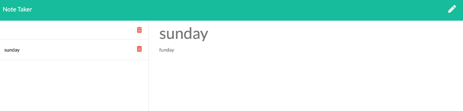

# NoteTaker

## Description 
Set up a list of notes with a title and text, while using the Heroku web application supported by your back-end server. 

## Table of Contents 
* [Installation](#installation)
* [Usage](#usage)
* [Credits](#credits)
* [License](#license)

## Installation 
From the Github repo, git clone the repo SSH link to your local computer through your command line terminal. Install node.js packages by typing "npm init -y" and then install the Express package by typing "npm i express". Homebrew needs to be installed, and you can visit the Homebrew homepage to follow the instructions on how to install. Once Homebrew is installed, you can create a Heroku account and once created, in your command line type in "heroku create" which will generate your own URL through Heroku, and then type "heroku open" to open the webpage. This application is already deployed to Heroku URL, so after the npm packages are installed, type "npm start" to open up your server, and the Heroku webpage will be functional.

## Usage 
When on the Heroku webpage, you can type in a Note Title and then below it type in text related to your title. 

## Heroku Link: 
https://intense-scrubland-53620.herokuapp.com/

    
## Credits 
UofA Coding Bootcamp starter code

## License 
Node.js, Express JS, Heroku

## Contributing 
An open issue will describe how to contribute in the GitHub repo.
